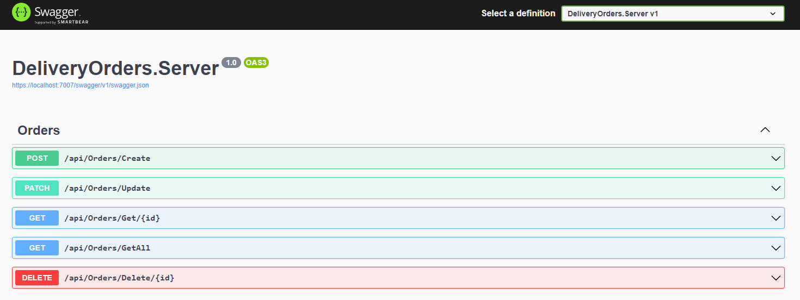
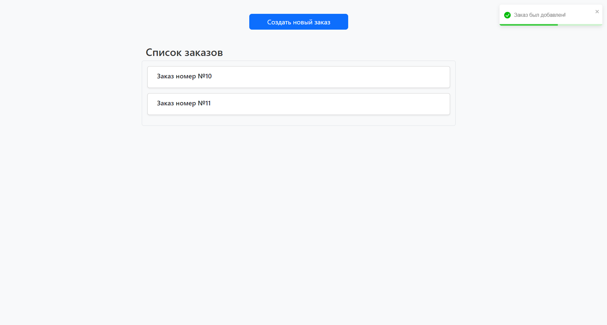
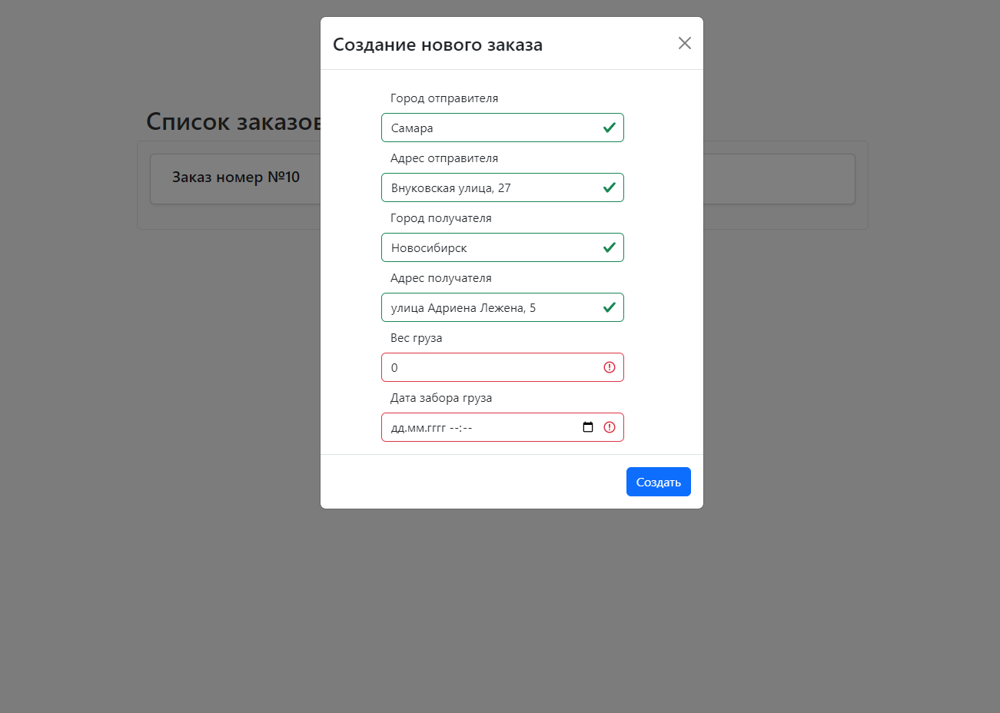
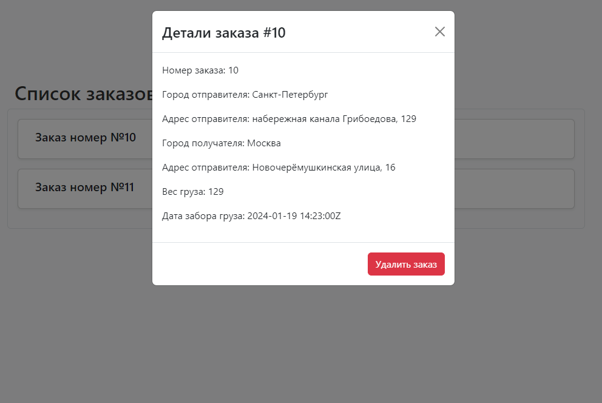
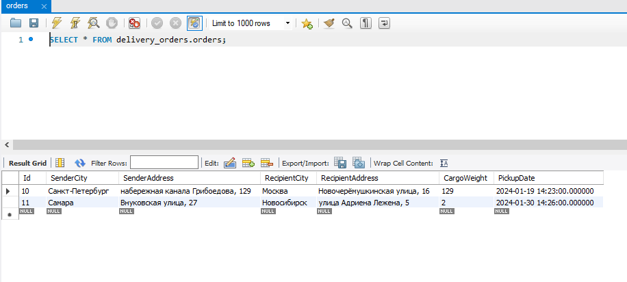

# DeliveryOrders

Тестовое задание на вакансию 'Junior Разработчик C# .Net'.

## Иcпользуемые технологии

1. ASP.NET 8;
2. React.JS (включая библиотеки bootstrap, react-bootstrap, react-toastify);
3. СУБД MySQL 8.0;
4. NuGet пакеты: `MySql.Data`, `MySql.Data.EntityFramework`, `MySql.EntityFrameworkCore`, `Microsoft.EntityFrameworkCore.Tools`

## Установка и запуск

1. Склонируйте репозиторий: `git clone https://github.com/sheim0-o/VerstaTest.git`;
2. Установите СУБД MySQL с официального сайта: `https://dev.mysql.com/downloads/`;
3. Установите Node.js и npm с официального сайта: `https://nodejs.org/en`;
4. Установите .NET 8 с официального сайта: `https://dotnet.microsoft.com/en-us/download/dotnet/8.0`;
5. Перейдите в папку проекта с сервером: `cd DeliveryOrders.Server`;
6. Измените строку подключения к базе данных - `dotnet user-secrets set ConnectionStrings:DefaultConnection "Server=<sever_name>;Database=<database_name>;User=<user_name>;Password=<password>;"`;
7. Установите драйвера MySQL для .NET: 
    7.1. `dotnet add package MySql.Data`,
    7.2. `dotnet add package MySql.Data.EntityFrameworkCore`,
    7.3. `dotnet add package MySql.EntityFrameworkCore`,
    7.4. `dotnet add package Microsoft.EntityFrameworkCore.Tools`;
8. Обновите базу данных: 
    8.1. `dotnet ef migrations add <migration_name>`,
    8.2. `dotnet ef database update`;
9. Запустите проект командой `dotnet run` и перейдите на страницу, указанную в терминале.

## Изображения/Скриншоты

*Документация API на Swagger*

*Главная страница WEB-приложения*

*Форма создания заказа*

*Форма с детальной информацией о заказе и кнопкой для удаления его*

*Список заказов в MySQL Workbench*